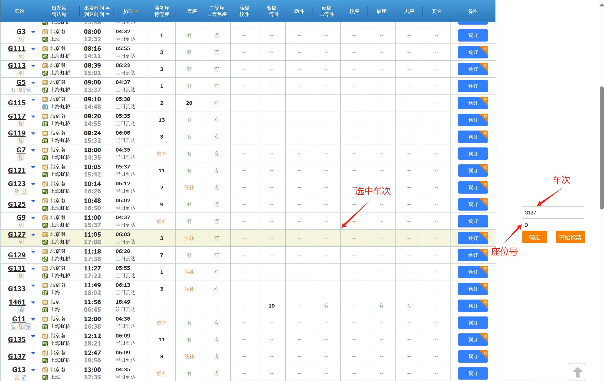

# 12306抢票脚本

## 
***声明抢票结果(抢错或没抢到)与本人无关***

### 使用说明:

* 当进入购票界面，右侧会弹出input窗口，第一个窗口填入车次(如:G317),第二个窗口填入座位号(如:F)。
* 按确定键可查看选中车次，如图1-1。
 
*                          图片1-1
* 确认无误后点击开始抢票，脚开始运行。

*********************************

### 注意事项

* ***抢票之前确保用户登录成功，否者报错！***
* ***脚本如若未能抢票，进入控制台查看，出现页面卡顿请立即退出页面。***
* ***脚本整除运行后可上12306app进行支付，勿浪费网络资源。***
